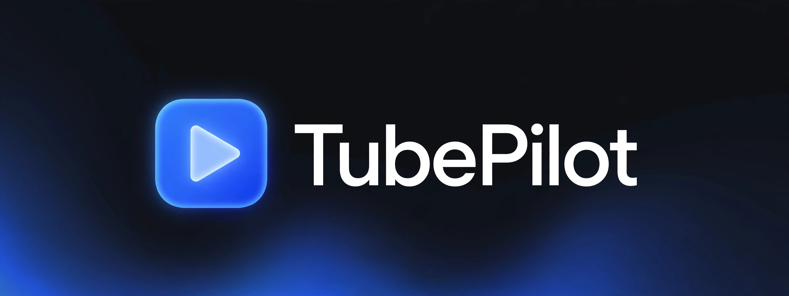

  <a href="README.md"><strong>English</strong></a> ·
  <a href="README.ko.md">한국어</a> ·
  <a href="README.ja.md">日本語</a> ·
  <a href="README.es.md">Español</a> ·
  <a href="README.pt.md">Português</a>

  

  <strong>YouTube on PC, like ReVanced.</strong> 
  Skip ads, jump over sponsors, and save videos with tags for later.

  
  
  
  
  

---

## ✨ Features

| | Feature | Description |
|---|---|---|
| ⏭ | **Auto-skip video ads** | Auto-clicks the skip button when pre-roll/mid-roll ads are detected. Unskippable ads are seeked to the end + 16x speed + muted, then your original volume/rate is restored |
| 🟩 | **SponsorBlock marking + skip** | Sponsor/intro/outro/self-promo segments shown as colored markers on the progress bar, with auto-skip. Per-category on/off (uses the public SponsorBlock API) |
| 🔍 | **Video zoom & pan** | Zoom up to 400% with ＋/－ buttons, drag the video to pan while zoomed |
| 💬 | **Hide comments (focus mode)** | Hides the entire comment section so you can focus on the video |
| 📚 | **Watch-later library** | Save videos with tags + keywords/notes. Auto-extracts `#hashtags` from descriptions, tag-chip filters + unified search across title/channel/tags/notes. Reopening a saved video shows a **recall banner** with its tags and notes, so you instantly remember why you saved it |
| 💾 | **Backup & restore** | Export settings + library as a JSON file and restore them anytime |
| 📷 | **Screenshot** | Save the current video frame as a PNG file (`Alt+S`), cropped to the player area |
| ⌨️ | **Keyboard shortcuts** | `Alt+S` capture · `Alt+H` hide-comments toggle · `Alt+B` save dialog |

Everything is toggled from the 🎬 panel at the bottom-right of YouTube pages.
**Drag the panel header to place it anywhere** (position is saved, double-click to reset).
Pin it **below the player** in panel settings and it follows player resizes.
**Click a colored marker** on the progress bar to jump straight to that segment's start.

🌍 UI available in **한국어 · English · 日本語 · Español · Português** — auto-detected from your browser, switchable anytime from the extension popup.

## 📦 Install

### A. Browser extension (recommended)

1. Clone this repo, or download + unzip `tubepilot-1.8.0.zip` from the [latest release](https://github.com/sapgun/tubepilot/releases)
2. Go to `chrome://extensions` → enable **Developer mode** (top-right)
3. Click **Load unpacked** → select the `extension/` folder
4. Open youtube.com → done when the 🎬 panel appears at the bottom-right

> The TubePilot toolbar icon controls master on/off and language. Fine-grained settings live in the 🎬 panel on YouTube pages.

### B. Userscript (alternative)

Tampermonkey / Violentmonkey users can use `tubepilot.user.js` directly.
Open the file in your browser after installing a userscript manager and confirm the install prompt.
(`@updateURL` checks for new versions automatically)

## 🚀 Usage

- **Ad skip**: just leave it on. Ads are skipped automatically.
- **Sponsor segments**: check the colored markers on the progress bar; turn off unwanted categories in the panel.
- **Zoom**: ＋/－ buttons in the panel; drag the video to pan when zoomed over 100%.
- **Save for later**: panel **Save** button → add tags and notes. `#hashtags` from the description can be added with one click.
- **Library**: panel **List** button → filter by tag chips or type in the search box.

## 🔒 Privacy

- Settings and the watch-later library are stored **only in your browser's local storage**. Never sent anywhere.
- When looking up sponsor segments, the video ID is sent to the public SponsorBlock API (`sponsor.ajay.app`). No other personal data is transmitted.

## ❓ FAQ

**Can I use it with uBlock Origin?**
Yes. TubePilot skips at the player level instead of blocking network requests, so they don't conflict.

**Sponsor segment markers don't show up.**
SponsorBlock data is community-contributed, so some videos simply have no segment data.

**Does it work on Safari / Firefox?**
Yes, via the userscript (`tubepilot.user.js`) version.

**What if a YouTube update breaks it?**
YouTube DOM changes can break features. Please [file an issue](https://github.com/sapgun/tubepilot/issues).

## 🗺 Roadmap

- [ ] Publish on the Chrome Web Store
- [ ] Keyboard shortcuts
- [ ] Timestamped notes when saving

## 🤝 Contributing

Bug reports and feature requests via [issues](https://github.com/sapgun/tubepilot/issues); code contributions via PR.
Before a PR, please run `cd extension/test && npm install && npm test`.

## 📄 License

MIT — see [LICENSE](LICENSE).
